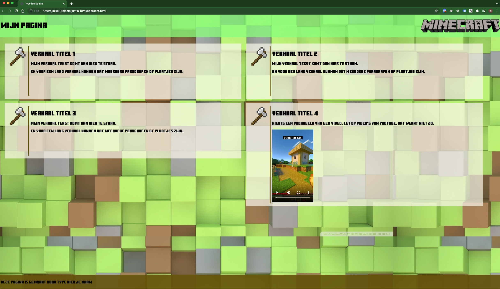

# HTML pagina maken

## Basis kennis

### HTML
Velen denken dat het een programmeertaal is, maar dit is niet het geval. HTML programmeren is dus niet correct verwoord, maar dit wordt wel vaak gezegd. Met alleen HTML zal je website er wel kaal uitzien, maar het is een begin. HTML staat voor “Hyper Text Markup Language”. HTML is een opmaaktaal. HTML beschrijft de opmaak/structuur van een webpagina. Om een browser die de HTML pagina weergeeft te vertellen hoe hij het moet tonen, gebruik je HTML elementen (ook wel tags genoemd). Deze HTML elementen zet je meestal om het stukje tekst heen dat je wil beinvloeden. Dus de meeste HTML elementen bestaan uit een begin element en een eind element. 

```html
<!DOCTYPE html>
<html>
<head>
    <title>Titel van de pagina</title>
</head>
<body>
    <h1>Hoofdstuk 1</h1>
    <p>Paragraaf 1.</p>
    <p>Paragraaf 2.</p>
  
    <h1>Hoofdstuk 2</h1>
    <p>Paragraaf 1.</p>
    <p>Paragraaf 2.</p>
</body>
</html>
```

```<!DOCTYPE html>``` = Betekent dat het een HTML5 document is.

```<html>``` = Is het kernelement van het document.

```<head>``` Bevat meta informatie over het document, zoals een beschrijving, de auteur, de titel enz.

```<title>``` = Bevat de titel van het document. Deze titel komt in het tabblad van de browser te staan, wanneer de website daar openstaat.

```<body>``` = Hierin staat de zichtbare content op de website.

```<h1>``` = Bevat een grote titel, meestal de eerste kop van een pagina.

```<p>``` = Bevat een paragraaf.

Bijvoorbeeld om tekst dik te drukken gebruik je het begin element &lt;b&gt;**vervolgens je tekst en dan het afsluitende element**&lt;/b&gt;. Het resultaat is dat de tekst tussen deze elementen dik wordt gedrukt!

Belangrijk bij HTML is dat de volgorde van afsluiten van de elementen in de omgekeerde volgorde gebeurd als het openen. 
Even een voorbeeld hiervan:
```html
<p>Hier een stukje tekst met niet in de juiste volgorde afgesloten <b>HTML elementen.</p></b>
```
Hier zien we dat we eerst een paragraaf maken, dan een stukje tekst dik willen drukken, maar dan sluiten we eerst de paragraaf af en dan pas de dik gedrukte tekst. Dit begrijpt een browser niet en daardoor kan je hele vreemde resultaten krijgen in de browser. Let dus goed op dat je de elementen (tags) in de juiste volgorde afsluit. De goede volgorde was:

```html
<p>Hier een stukje tekst met niet in de juiste volgorde afgesloten <b>HTML elementen</b>.</p>
```
Een HTLM editor zoals Visual Studio Code kan je hierbij helpen door bijvoorbeeld de open en sluit elementen op een aparte regel te zetten of door ze van een kleur te voorzien, waardoor je ziet dat het niet goed is afgesloten.

Er zijn een paar speciale elementen die niet een afsluitend element hebben, maar direct worden afgesloten. Voorbeelden van veel gebruikte elementen zijn:
* img voor het zetten van een plaatje
* br voor het gaan naar de volgende regel
* hr voor het zetten van een lijn

Voorbeeld:
```html

```
Zoals je ziet wordt deze dus afgesloten door voor het &gt; teken een / te zetten.

Soms gebruik je in een HTML element ook nog attributen. Zoals hierboven in het voorbeeld van het plaatje waar **width** wordt gebruikt. Hiermee kan je het HTML element nog extra eigenschappen meegeven die de weergave beinvloeden. In dit geval zeggen we hiermee dat het plaatje maximaal 200 breed mag worden weergegeven. Is het plaatje groter, dan zal de browser het voor ons verkleinen.

Veel voorkomende HTML elementen zijn:

* header de kop van het document
* footer de staart van het document
* main de inhoud van het document
* section een sectie van het document
* div voor het groeperen van elementen op een pagina
* p voor paragraaf
* b voor dik gedrukt (bold)
* i voor schuin gedrukt (italic)
* h1 wordt gebruikt voor de pagina titel
* h2 voor een kop
* h3 voor een tussenkop
* img voor een plaatje
* video voor een video
* nav voor navigatie elementen zoals een menu 
* aside voor een sectie die aan de zijkant moet komen van het document. Vaak gebruikt voor navigatie e.d.
* table voor een tabel
* tr voor een rij in een tabel
* td voor een kolom in een tabel

Bovenstaande elementen komen dus altijd tussen een **&lt;** en een **&gt;** te staan en worden **tags** genoemd.
Voor meer informatie, kijk eens op [dit webboek](https://www.ria-maria.nl/boeken/HTML5andCSS3/HTML5hoofdstuk2.html) of naar [de volledige lijst van HTML elementen](https://developer.mozilla.org/en-US/docs/Web/HTML/Element).
### CSS
Bij het maken van een HTML pagina gaat het niet alleen om het plaatsen van tekst, paragrafen en plaatjes. Het gaat ook om zaken als tekst kleur, marges, lijntjes, achtergrondkleuren en plaatsen van de elementen op de pagina.
Hiervoor gebruiken we CSS, Cascading Style Sheets.
CSS zorgt dus voor de opmaak van de elementen. Daarbij kan je voor elk bestaand HTML element de vormgeving bepalen. Zo kan je bijvoorbeeld aangeven dat voor het element **&lt;p&gt; de kleur van de letters groen moet zijn:
```css
p { color: green;}
```
Maar je kan specifieke HTML elementen ook van CSS voorzien door het element het **id** attribuut of het **class** attribuut mee te geven. Dus bijvoorbeeld:
```html
<div id="element">Hier wat tekst</div>
```
De CSS om dit element in de kleur oranje te verander zou zijn:
```css
#element {
    color: orange;
}
```
Let op! Het attribuut id moet een unieke waarde hebben op de hele pagina. Dus als je bijvoorbeeld een element hebt dat vaak voorkomt op de pagina kan je beter het attribuut **class** gebruiken. Dat gaat als volgt:
```html
<div class="element">Hier wat tekst</div>
```
De CSS om dit element in de kleur oranje te verander zou zijn:
```css
.element {
    color: orange;
}
```

Wil je meer weten over CSS, dan kan je bijvoorbeeld [deze pagina](https://wikikids.nl/Cascading_Style_Sheets) eens lezen.
# Opdrachten
Het doel van de opdrachten is om langzaam zelf een webpagina in elkaar te zetten. En onderweg een aantal verschillende elementen te leren kennen van zowel HTML als van CSS. Het eindresultaat moet er ongeveer zo uit gaan zien:

## Opdracht 1
Download de repository als ZIP file. Maak een directory waarin je gaat werken en kopieer de ZIP file die je hebt gedownload daarnaartoe en pak hem daar uit.

Open het bestand index.html met [Visual Studio Code](https://code.visualstudio.com/download).
Zet hierin de basis HTML structuur zoals elke HTML pagina moet bevatten:

```html
<!DOCTYPE HTML>
<html lang="nl">
<head>
    <title>Type hier je titel</title>
</head>
<body>
HIER KOMT DE INHOUD
</body>
</html>
```
Deze structuur bevat dus altijd een stukje HEAD met informatie voor de browser en een stukje BODY waar de inhoud in terecht komt, zeg maar het stuk wat je in je browser ziet.

Open nu dit bestand met chrome (rechter muistoets open with Chrome).
Je ziet nu het de weergave van het document, de titel staat in de titel balk van Chrome en je ziet een wit scherm met daarin *HIER KOMT DE INHOUD*.

## Opdracht 2
Nu willen we de pagina gaan indelen. De meeste webpagina's zijn ingedeeld in drie herkenbare delen:
1. De header (kop)
2. De inhoud (tekst / plaatjes)
3. De footer

Nu gaan we onze pagina ook indelen in die drie stukken. Allereerst voegen we de header toe, die plaatsen we dus in het stuk waar nu **HIER KOMT DE INHOUD** staat, als de inhoud van het *body* element:
```html
<header>
    <h1>Mijn pagina</h1>
</header>

```

En dan nu gaan we de inhoud plaatsen. Dit doen we door aan te geven dat we een sectie op de pagina maken met de tag *&lt;section&gt;*. 

```html
<main>
    <section id="inhoud">
        Dit is de plek voor de inhoud van de pagina.
    </section>
</main>
```

En als laatste voegen we de footer toe:
```html
<footer>
    <p>Deze pagina is gemaakt door TYPE HIER JE NAAM</p>
</footer>

```
Hiermee laten we zien door wie de pagina is gemaakt. Websites tonen vaak onder aan hun pagina contact gegevens, telefoonnummers of route beschrijvingen.

Bekijk je pagina weer in Chrome (je kan gewoon de pagina verversen!)

## Opdracht 3
Nu gaan we beginnen om de pagina wat leuker te maken. We willen in de header een plaatje toevoegen. Veelal wordt in de header van een site een logo geplaatst. Volg nu de volgende stappen om jouw logo toe te voegen:
1. Maak een directory *images* aan in de directory waar jouw index.html staat.
2. Kopieer alle bestanden uit de opdracht/images directory naar jouw images directory.
3. Voeg nu onderstaand HTML element toe aan jouw header:
```html

```

Ververs je pagina in Chrome. Je ziet nu ineens een heel groot logo verschijnen naast je titel van de pagina.
Probeer nu eens de plek waar je het plaatje hebt toegevoegd te veranderen. Zet hem bijvoorbeeld eens in het &lt;h1&gt; element. Of zet hem eens voor en na het  &lt;h1&gt; element.

Nu zie je een heel groot plaatje, eigenlijk iets te groot. Gebruik daarom het attribuut **width** om het plaatje kleiner op het scherm te krijgen. Dit doe je bijvoorbeeld als volgt:
```html

```
500 is natuurlijk nog steeds te groot. Je kan de breedte kleiner maken, maar ook ervoor kiezen om niet **width** te gebruiken, maar juist de hoogte in te stellen. Probeer onderstaande eens:
```html

```

## Opdracht 4
We hebben nu een titel, een logo, een middenstuk en een footer. Laten we een naar het middenstuk, de inhoud gaan kijken. Stel je wil daar kleine verhaaltjes neerzetten, bijvoorbeeld met een plaatje erbij, hoe zou dat dan moeten?

We hebben al de sectie aangemaakt voor de inhoud. Als je een bouw blok wil toevoegen, een stukje dat bij elkaar hoort, dan doen we dat met een **&lt;div&gt;** element. In zo'n groep kan je dan plaatjes en paragrafen plaatsen.

Kopieer het bestand *axe.png* naar jouw images directory.
Probeer eens het volgende:
```html
<div>
    
    <p>Dit verhaal gaat over mijn bijl...</p>
</div>
```

## Opdracht 5
Nu heb je eigenlijk de eerste opzet van je pagina gedaan. Maar bij een HTML pagina is het juist ook heel leuk om bijvoorbeeld de kleur van de tekst, het lettertype e.d. te bepalen. Hoe doe je dat dan?

Deze styling doen we met wat we noemen CSS (Cascading Style Sheets). Hiervoor moet je de volgende stappen doorlopen:
1. Maak een directory css aan in de directory waar je index.html staat.
2. Maak een bestand stijling.css aan in deze nieuwe css directory.
3. Plaats onderstaande code in het stijling.css bestand:
```css
body {
  margin: 0;
  padding: 0;
  color: black;
  background-image: url("../images/background-4.jpg");
}
```
Hiermee geven we aan dat er geen marges (kantlijn) wordt gebruikt om iets op de pagina te plaatsen en ook geen ruimte eromheen (padding). De tekstkleur is zwart (kan ook in hexadecimale notatie met #000000 worden aangeduid.) en we plaatsen een achtergrond plaatje op de pagina.

4. Voeg onderstaande code toe aan de **&lt;head&gt;** sectie van jouw index.html, zodat de stijling die je hierboven hebt toegevoegd wordt gebruikt in jouw pagina:
```html
<link rel="stylesheet" href="css/stijling.css" />
```

Ververs je index.html pagina en kijk naar het resultaat.
Mooi? Hmmm, niet helemaal goed leesbaar zo!

Daar kunnen we wel wat aan doen. We kunnen de tekst leesbaarder maken door het vlak waar de tekst op wordt geplaatst een achtergrond te geven die een beetje doorschijnend is. Dan kan je toch de achtergrond nog zien **en** de letters beter lezen!

Om dat te doen gebruik je de css:
```css
header, footer, main {
    background: rgb(250, 247, 233, 0.8);
    margin: 10px;
    padding: 10px;
}
```

Als je wilt kan je ook nog spelen met de achtegrond door in stijling.css het achtergrondplaatje te vervangen met een ander plaatje uit de directory, bijvoorbeeld background-2.jpg of background-3.jpg.

## Opdracht 6
OK, nu ziet onze pagina er al best aardig uit, maar er hoort nog een lettertype bij wat meer bij het onderwerp past. Dus in dit geval Minecraft. Voeg de volgende regel toe in de stijling.css in het stukje waarin de **body** stijling wordt gedaan.
 
 ```css
  font-family: "Minecraft", sans-serif;
```
Daarmee wordt het totaal dus zo:
```css
body {
  margin: 0;
  padding: 0;
  color: #000000;
  background-image: url("../images/background-4.jpg");
}
```

Nu is het lettertype al veranderd, naar een schreefloos lettertype, maar nog niet het specifieke Minecraft lettertype. Die gaan we nu toevoegen in de index.html. Voeg in de **&lt;head&gt;** sectie de volgende regel toe na de regel met **&lt;title&gt;...&lt;/title&gt;**:
```html
<link href="http://fonts.cdnfonts.com/css/minecraft-4" rel="stylesheet" />
```
Nu nog het logo van Minecraft aan de rechterkant plaatsen, zodat de header er wat strakker uitziet. Dit doen we door de volgende stijling toe te passen:
```css
    float: right;
```
Vervolgens zetten we het logo voor de **&lt;h1&gt;** en voila, het logo staat rechts op dezelfde hoogte als mijn pagina titel.

Nu willen we de header en footer nog iets beter stijlen door ze over de hele breedte van het scherm te laten lopen. Dit doen we door het eerdere stukje:
```css
header, footer, main {
    background: rgb(250, 247, 233, 0.8);
    margin: 10px;
    padding: 10px;
}
```

te vervangen met

```css
header {
  background: rgba(129, 255, 118, 0.75);
  height:90px;
  padding: 10px;
}

main {
  overflow-y: auto;
  margin-bottom:70px;
  min-height: 200px;
  max-height: 79vh;
  display: flex;
  flex-direction: row;
}

footer {
  background: rgba(100, 82, 0, 0.9);
  width:100%;
  height:50px;
  padding:10px;
  position:fixed;
  bottom:0;
}
```
Dat ziet er een stuk beter uit! Alleen het stukje met de verhaaltjes is nog niet zo mooi. Dat doen we in de volgende opdracht!

## Opdracht 7
We hebben om te beginnen een voorbeeld verhaaltje over 'mijn bijl' geplaatst. Echter we willen natuurlijk op deze pagina een heleboel verhaaltjes gaan zetten. Daarbij willen we de verhaaltjes eigenlijk naast elkaar zetten als het op het scherm past.
Hoe doen we dat nu in HTML? Dan gebruiken we de &lt;div;&gt tag om de groepjes te organiseren en met css kunnen we dan aangeven hoe we de verhalen willen uitlijnen. Door het attribuut **class** te zetten kunnen we onze eigen stijling definitie maken in css. Maar eerst maken we de opzet van de verhaal kolommen als volgt:
```html
<div class="verhaal">Verhaal 1</div><div class="verhaal">Verhaal 2</div>
<div class="verhaal">Verhaal 3</div><div class="verhaal">Verhaal 4</div>
```

Vervolgens wil je het verhaal ook mooier maken door een plaatje te tonen met daarnaast de titel en de tekst. Dat doe je zo:
```html
<div class="verhaal-image"></div>
<div class="verhaal-content"><h2>Verhaal titel</h2><p>Mijn verhaal tekst komt dan hier te staan.</p><p>En voor een lang verhaal kunnen dat meerdere paragrafen of plaatjes zijn.</p></div>
```
Deze stukken plak je over de eerder geplaatste tekst *Verhaal 1* enzovoorts heen.
Nu staan de verhalen allemaal onder elkaar. Dit gaan we nu aanpasen door stijling toe te passen:
```css
#inhoud {
  margin: 10px;
  padding: 10px;
}

.verhaal {
  margin: 10px;
  padding: 10px;
  width:47%;
  min-width: 40%;
  display: inline-flex;
  min-height: 250px;
  background: rgb(250, 247, 233, 0.7);
}

.verhaal-image {
  margin:4px;
  max-width: 200px;
  border-right: 4px solid rgba(100, 82, 0)
}

.verhaal-content {
  margin: 4px;
}
```
Hiermee geven we aan dat een verhaal altijd een wittig doorzichtige achtergrond heeft en minimaal 200 pixels hoog en maximaal 400 pixels. De truuk van het naast elkaar plaatsen zit hem in de regel:
```css
 display: inline-flex;
```
Hierdoor worden de &lt;div&gt; elementen naast elkaar geplaatst mits het past. Zo niet dan worden ze naar de andere regel verplaatst.


## Opdracht 8
Nu gaan we een video in het laaste bericht plaatsen. Een video die lokaal staat kan je makkelijk toevoegen. Een video vanuit Youtube of andere bronnen is iets ingewikkelder, dat leren we later. 

Voor nu beginnen we met de video die in de *movies* directory staat. We gaan deze plaatsen op de plek van Verhaal 4:
```html
<div class="verhaal-content">
    <h2>Verhaal titel 4</h2>
    <p>Hier is een voorbeeld van een video. Let op video's van youtube, dat werkt niet zo.</p>
    <video controls="controls" src="movies/minecraft-shortie.mp4" width="200">
        Your browser does not support the HTML5 Video element.
    </video>

</div>
```
